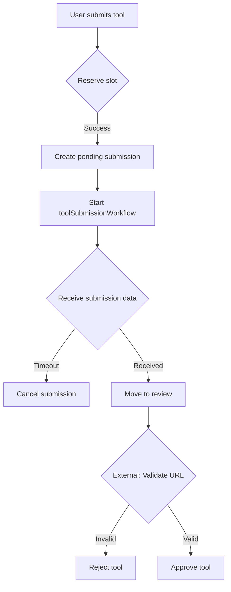
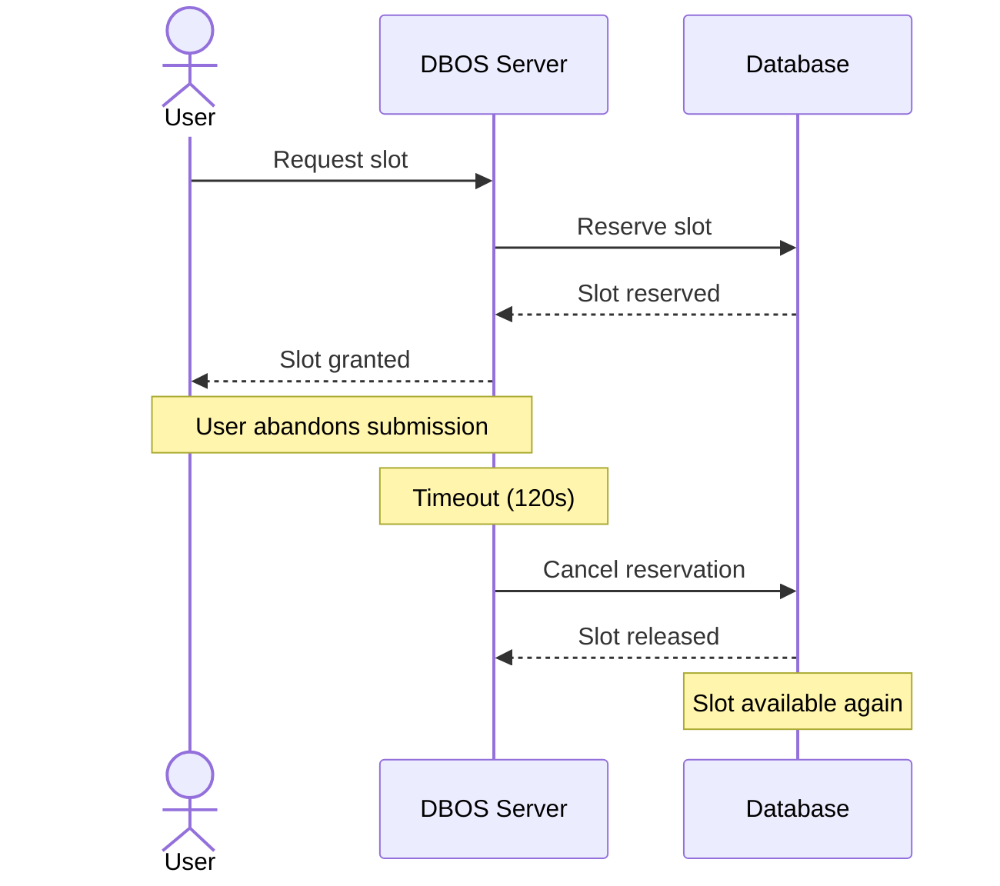
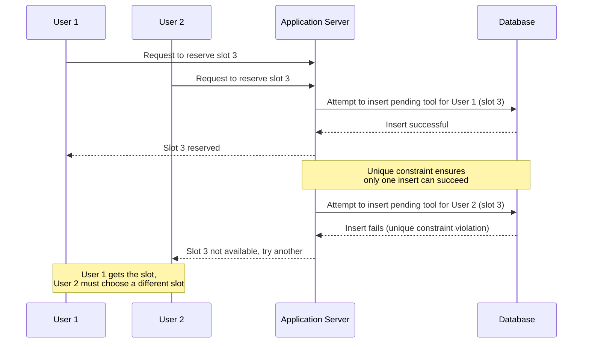
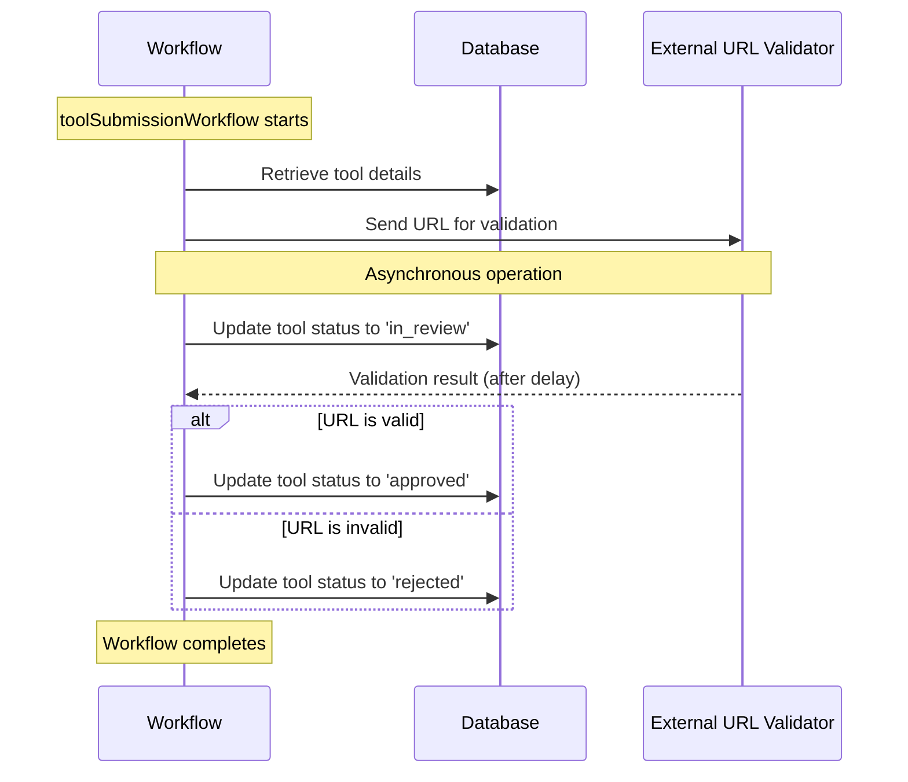
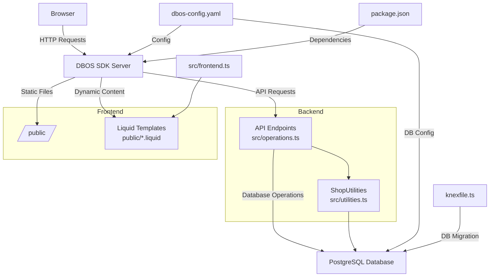

# workflow-orchestration-tools

## Worflow

## Potential Issues and Mitigations

The `toolSubmissionWorkflow` addresses several potential issues:

1. **Slot Contention**: 
   - Issue: Multiple users attempting to reserve the same slot simultaneously.
   - Mitigation: Unique database constraint on active slots ensures atomic reservations.

2. **Abandoned Submissions**: 
   - Issue: Users starting but not completing tool submissions.
   - Mitigation: Timeout mechanism automatically cancels incomplete submissions.

3. **Application Crashes**: 
   - Issue: System failures during workflow execution.
   - Mitigation: DBOS's recovers workflow from last consistent state.

4. **Duplicate Submissions**: 
   - Issue: Network issues causing multiple submissions of the same tool.
   - Mitigation: Workflow UUID used as idempotency key to prevent duplicate processing.

5. **Data Inconsistency**: 
   - Issue: Database operations failing mid-workflow.
   - Mitigation: DBOS's transactional execution ensures atomic database operations within workflows.

## Use Case: User Abandons

## Use Case: Two Users Want Same Slot

## Use Case: Validating Submissions

## Code Layout

