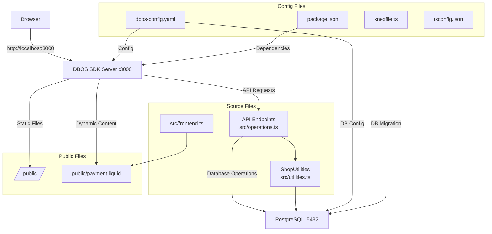

# workflow-orchestration-tools

```mermaid
graph TD
    A[Browser] -->|http://localhost:3000| B[DBOS SDK Server :3000]
    B -->|Static Files| C[/public/]
    B -->|API Requests| D[API Endpoints<br>src/operations.ts]
    D -->|Database Operations| E[PostgreSQL :5432]
    B -->|Dynamic Content| F[public/payment.liquid]
    D --> G[ShopUtilities<br>src/utilities.ts]
    G --> E
    H[dbos-config.yaml] -->|Config| B
    H -->|DB Config| E
    I[package.json] -->|Dependencies| B
    J[knexfile.ts] -->|DB Migration| E
    K[src/frontend.ts] --> F

    subgraph "Config Files"
        H
        I
        J
        L[tsconfig.json]
    end

    subgraph "Source Files"
        D
        G
        K
    end

    subgraph "Public Files"
        C
        F
    end
```
